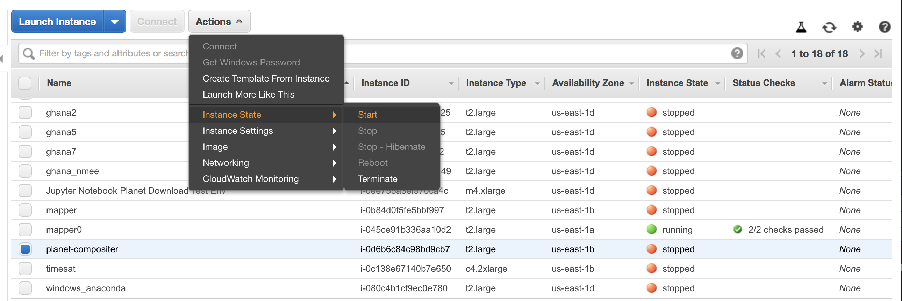

***
<center>
[Back to **index**](../README.md)
</center>
***


## The template instance{#the-template-instance}
An instance with the latest version of Anaconda and a working jupyter notebook and ssh connections already exists.  It is a t2.large (2 processors and 4 GB RAM) with a 30 GB EBS volume. This is for getting started, to test your connections and ability to access it, and add and install necessary packages, etc. We can create an image from that and launch it with a larger instance as need. 

## Start the instance

In your local shell, run this:
```bash
IID=<instance-id>
aws ec2 start-instances --instance-ids $IID
```

You can also do this manually by logging into the AWS console with your credentials, and finding the EC2 instances named "planet-compositer", and launching it. 



But the CLI is easier, I believe. Even easier is to use the companion `start_instance.sh` script to launch it simply using the instance's name. The existing instance is called "planet-compositer", so you can do this:

```bash
./scripts/start_instance.sh
```

And it will prompt you to enter the instance name ("planet-compositer"). The whole sequence will look like this:

```bash
$ ./scripts/start_instance.sh
Enter instance name: planet-compositer
Starting instance named planet-compositer with id i-XXXXXXXXXXXXXXX
STARTINGINSTANCES       i-XXXXXXXXXXXXXXX
CURRENTSTATE    0       pending
PREVIOUSSTATE   80      stopped
```

Note that you might have to change the script to make it executable first for this to work:
```bash
chmod a+x scripts/start_instance.sh
```

Now, you will want to do a few things. First, you need to get the public DNS of the instance, now that it is running.  

```bash
IP=`aws ec2 describe-instances --instance-ids $IID --filters --query "Reservations[].Instances[].PublicIpAddress"`
echo $IP
```

***
<center>
[Back to top](#the-template-instance) || [Back to **index**](../README.md)
</center>
***

## Configure your local machine
Now you will need to make some changes to your local machine to be able to connect to the jupyter notebook.  

That public IP variable is important, because each time you start the instance (if it was stopped, which it should be, if you aren't working with it), it changes. 

On your local machine, you will want to do the following get jupyter notebooks to work:

```
vim ~/.ssh/config
```

And copy this block of text below any existing text there, replacing the values between and including the <> with the IP address (hard-coded, and note that each time you restart the instance this will have to be redone)
```bash
Host ubuntu
 Hostname <replace with values in $IP, and remove the <> >
 User ubuntu
 IdentityFile ~/.ssh/id_rsa
```

Then, ssh into the instance, which you can do by simply running:
```bash
ssh ubuntu@$IP
```

Note that the ssh call uses the variable name for the URL. 

Now, within the notebook, simply type:
```bash
jupyter notebook --no-browser
```

And within the terminal on your local machine, execute this:
```bash
ssh -NfL 9999:localhost:8888 ubuntu
```

And then, within the terminal window on the instance, copy the URL that looks like this:

```bash
http://localhost:8888/?token=<alongtokenstring>
```

And replace 8888 with 9999, and paste it into your browser. That should open a jupyter notebook. You of course can run python from terminal since you are logged in via ssh to the instance, but this gives you more options. 

Remember that each time the instance is stopped and then restarted, there is a new public IP created, so you will have to update the IP address in  `~/.ssh/config` 

***
<center>
[Back to top](#the-template-instance) || [Back to **index**](../README.md)
</center>
***

## Configure the instance to run `imager`
At this stage, you should make any additional changes that you need to run the `imager`, e.g. install any necessary `python` and `C` libraries, etc.

Once this is done, you will clone this repo onto the instance, which will give you everything you need to run compositer 

## Stop the instance
When you are done with your work, please stop the instance. This command from your local terminal instance will do it. 
```bash
aws ec2 stop-instances --instance-ids $IID
```
Or you can use the companion `stop_instance.sh` in this repo. Otherwise within the console, go to Action > Instance State > Stop while the "planet-compositer" line is checked. 

You now have a fully configured instance for running compositer, and you can make an AMI of the stopped instance that is the template for spinning up production instances with larger volume sizes and higher capacity instances to do the heavy work. Instructions for creating an AMI and launching a new instance are in [another document](setup-aws-instance.md). 

***
<center>
[Back to top](#the-template-instance) || [Back to **index**](../README.md)
</center>
***
