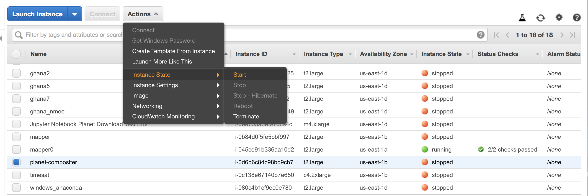

# Launch AWS jupyter notebook instance

The existing instance is a t2.large, which has 2 processors and 4 GB RAM and 30 GB memory. This should be enough to get started, as it is fully configured. We can create an image from that and launch it with a larger instance as need. 

## Start the instance

In your local shell, run this:
```bash
IID=<instance-id>
aws ec2 start-instances --instance-ids $IID
```

You can also do this manually by logging into the AWS console with your credentials, and finding the EC2 instances named "compositer", and launching it. 



But this is easier. Now, you will want to do a few things. First, you need to get the public DNS of the instance, now that it is running.  

```bash
IP=`aws ec2 describe-instances --instance-ids $IID --filters --query "Reservations[].Instances[].PublicIpAddress"`
echo $IP
```

## Make necessary local configurations
That public IP is important, because each time you start the instance (if it was stopped, which it should be, if you aren't working with it), it changes. 

On your local machine, you will want to run the following to do the following get jupyter notebooks to work:

```
vim ~/.ssh/config
```

And copy this block of text below any existing text there, replacing the values between <> with the IP address (hard-coded, and note that each time you restart the instance this will have to be redone)
```bash
Host ubuntu
 Hostname <replace with values in $IP, and remove the <> >
 User ubuntu
 IdentityFile ~/.ssh/id_rsa
```

Then, ssh into the instance, which you can do by simply running:
```bash
ssh ubuntu@$IP
```

Note that the ssh call uses the variable name for the URL. 

Now, within the notebook, simply type:
```bash
jupyter notebook --no-browser
```

And within the terminal on your local machine, execute this:
```bash
ssh -NfL 9999:localhost:8888 ubuntu
```

And then, within the terminal window on the instance, copy the URL that looks like this:

```bash
http://localhost:8888/?token=<alongtokenstring>
```

And replace 8888 with 9999, and paste it into your browser. That should open a jupyter notebook. You of course can run python from terminal since you are logged in via ssh to the instance, but this gives you more options. 

When you are done with your work, please stop the instance. This command from your local terminal instance will do it. 
```bash
aws ec2 stop-instances --instance-ids $IID
```

Otherwise within the console, go to Action > Instance State > Stop while the "planet-compositer" line is checked. 


